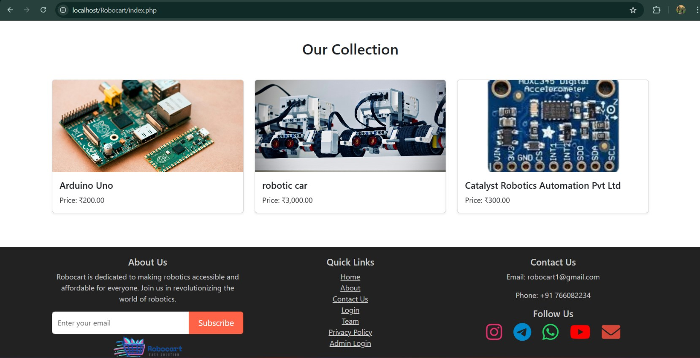

# 🤖 Robocart – Smart E-Commerce Platform for Robotics Components

**Robocart** is a final-year academic project aimed at providing a one-stop online platform for purchasing robotics components. Designed with engineering students and hobbyists in mind, Robocart offers a seamless user experience for browsing, selecting, and ordering various components used in robotics and automation projects.

---

## 📌 Key Features

- 🛍️ Wide range of robotics components
- 🔐 User registration and login system
- 🛒 Add to cart and checkout features
- 📦 Organized product categories
- 📞 Contact, team, and shop support
- 🧾 Sell project option for contributors
- 📱 Responsive interface design

---

## 📸 Screenshots

### 🔻 Home Page

![Home Page]


### 🔻 User Login


### 🔻 Product Listing



---

## 💡 Project Objective

> The goal of **Robocart** is to make robotics components more accessible and affordable for everyone—especially students. With increasing academic interest in robotics, Robocart serves as a go-to platform for sourcing components and sharing project work.

---

## 🛠️ Tech Stack

| Technology | Used For |
|------------|-----------|
| **HTML/CSS/JavaScript** | Frontend |
| **PHP** | Backend |
| **MySQL** | Database |
| **XAMPP** | Local Development |

---

## 🗂️ Folder Structure

Robocart/
├── index.php
├── login.php
├── register.php
├── product.php
├── contact.php
├── team.php
├── assets/
│ ├── css/
│ ├── js/
│ └── images/
├── db/
│ └── config.php
├── screenshots/
│ ├── Home Page.jpg
│ ├── user login.jpg
│ └── Product.jpg


---

## ⚙️ Setup Instructions

1. Clone this repo:
   ```bash
   git clone https://github.com/shubhamSuryawanshi221/Robocart.git

2.Place the folder in your local server root (e.g., htdocs for XAMPP).

3.Import the included .sql file into your MySQL database.

4.Update your DB credentials in db/config.php.

5.Start Apache & MySQL via XAMPP, then run http://localhost/Robocart.

👤 Developed By
Shubham Suryawanshi
📧 robocart1@gmail.com
GitHub • LinkedIn

📃 License
This project is for educational purposes. All rights reserved to the author.


### ✅ Final Notes:
- Save the screenshots in a `screenshots/` folder in your GitHub repo.
- Make sure filenames match exactly (`Home Page.jpg`, `user login.jpg`, `Product.jpg`).
- Push everything to GitHub (`README.md` and `screenshots/` folder).

Let me know if you want a contribution section or demo video section added.
This project is for academic and learning purposes only.
Feel free to explore and contribute.
